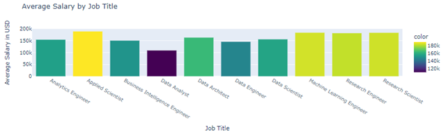

# Visualizing Current Data Science Salary Trends: Key Insights for Job Seekers

This project visualizes data science salary trends using the Kaggle dataset. By analyzing various factors like job titles, experience levels, and geographic regions, we provide key insights for job seekers and professionals. The complete analysis and visualizations are available below.

## Table of Contents

- [Introduction](#introduction)
- [Workflow Diagram](#workflow-diagram)
- [Related Work](#related-work)
- [Data Abstraction](#data-abstraction)
- [Task Description](#task-description)
- [Tools Description](#tools-description)
- [Visualization Graphs](#visualization-graphs)
- [References](#references)
- [Links](#links)

## Introduction

This project aims to analyze and visualize data science salary trends using a dataset from Kaggle. The dataset includes job titles, salaries, years of experience, and geographic data, providing comprehensive insights into the salary trends for data science professionals.

## Workflow Diagram

The workflow diagram illustrates the steps taken in our project, starting from data acquisition to preprocessing, analysis, visualization, and reporting. The data was obtained from Kaggle, cleaned, and prepared for detailed exploratory data analysis (EDA).

## Related Work

Exploring data science salary trends is essential for understanding the industry's dynamics. Several studies have focused on salary expectations, hiring trends, and the impact of AI on the job market, providing a foundation for our analysis.

## Data Abstraction

The dataset used for this project is in CSV format, containing job titles, salaries in USD, employee residence, experience levels, employment types, work settings, company locations, and company sizes. The dataset includes 9,355 entries, providing a detailed view of the data science job market.

## Task Description

### Target Audience

Our primary audience includes students, emerging professionals in data science, and career switchers. Recruiters and HR professionals can also benefit from the insights provided.

### Actions

The main actions performed in this project include data acquisition, preprocessing, analysis, visualization, and reporting. These steps transform raw data into graphic narratives that expose salary trends.

## Tools Description

### Data Processing & Visualization Tools

- **Python:** For data analysis and processing.
- **Pandas:** For data handling and manipulation.
- **Matplotlib and Seaborn:** For creating visualizations.
- **Jupyter Notebook:** For interactive coding and visualization.
- **Kaggle:** For dataset acquisition.

## Visualization Graphs

### 1. Salary Distribution by Job Title
Box plot representing salary distribution for various job titles.

### 2. Salary Distribution by Experience Level
Box plot showing salary distribution across different experience levels.

### 3. Salary Trends Over Years
Line plot demonstrating the upward trend in average salaries over the years.

### 4. Histogram of Salary Distributions
Histogram displaying the distribution of salaries across different roles.

### 5. Count of Job Titles by Experience Level
Stacked bar graph representing the count of job titles across various experience levels.

### 6. Average Salary by Year
Bar graph illustrating the average salary trends by year.

### 7. Salary Distribution by Geographic Region
Kernel density distribution comparing salaries across different regions.

### 8. Experience Level Salary Distributions
Violin plot showing salary distributions by experience level.

### 9. Interactive Geographic Distribution of Salaries
Box plot displaying the distribution of salaries across top 10 countries.

### 10. Interactive Salary Distribution by Job Category
Box plot showing salary distribution across different job categories.

### 11. Interactive Average Salary by Job Title
Bar chart representing average salaries based on job categories.

## References
1. Data Science 2023 Review: Trends and Salary Expectations
2. Data Science & AI Professionals Salary and Hiring Trends
3. Salary Trends: What to Expect in Data & Analytics Roles in 2024
4. Trends in Data Science Salaries: An Exploratory Data Analysis Journey
5. EDA and Visualizations on Data Science Salaries using Python
6. A. Kaur, D. Verma, and N. Kaur, "Utilizing Quantitative Data Science Salary Analysis to Predict Job Salaries," 2022 2nd International Conference on Innovative Sustainable Computational Technologies (CISCT), 2022
7. Tee, Zhen & Raheem, Mafas. (2022). Salary Prediction in Data Science Field Using Specialized Skills and Job Benefits - A Literature Review.
